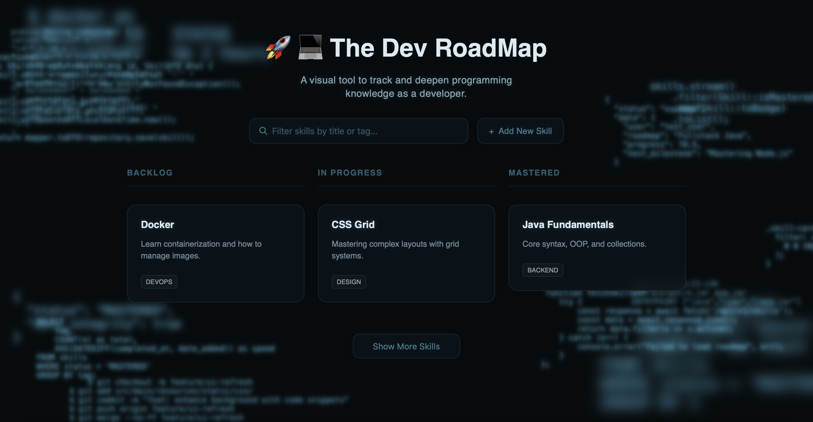

# The Dev RoadMap
**Stop collecting bookmarks. Start mastering skills.**

Learning new things can be challenging, especially when navigating the vast field of programming. 
You encounter new concepts, frameworks and techniques daily, often ending up with bookmarks, notes and to-do lists scattered all over the place.

Starting somewhere can feel like conquering a mountain - and once you do, how do you track your progress?

**The Dev RoadMap** is my take on solving this. Originally a school assignment,
this project is inspired by the structure of Kanban boards and tools like Trello, designed specifically for the developer's learning journey.

⚠️ **Note –** This project is currently a Work in Progress as I continue to refine features and the UI.

---

## ✨ Key Features
* **Visual Kanban Workflow –** Organize your learning in BACKLOG, IN PROGRESS, and MASTERED.
* **Intuitive Skill Tracking –** Easily add new topics and document your journey towards mastery.
* **Smart Filtering & Pagination –** Quickly find what you need with real-time filtering and dynamic "Load More" functionality.
* **Resource Management –** Keep essential documentation, source links and notes attached to every skill for quick reference.

## 🛠️ Tech Stack
* **Backend –** Java 25 & Spring Boot 4.0
* **Frontend –** Thymeleaf, Vanilla JavaScript, Modern CSS
* **Database –** PostgreSQL
* **Data Handling –** Spring Data JPA with Pagination support
* **DevOps –** Docker, Docker Compose, GitHub Actions (CI/CD)

## 📋 Requirements
* **Docker & Docker Desktop –** Recommended (runs everything with one command)
* **Alternative (Manual Setup) –** JDK 25, Postgres Server, and Maven.

## 🗺️ Upcoming Features:
* **Drag & Drop –** Move skill cards between columns for a more dynamic and interactive experience.
* **User Authentication –** Personal accounts to secure your data and enable private roadmaps.

## 🚀 Quick Start
1. Clone the repository.
2. Run `docker-compose up`.
3. Open `http://localhost:8080` in your browser.
4. **Explore –** The app comes pre-loaded with sample data to help you get started right away!
